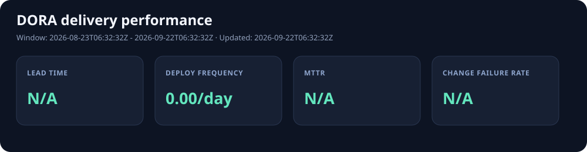

# 동아대학교 학습 저장소

## DORA 지표



매주 GitHub Actions가 최근 30일의 production 배포를 기준으로 Lead Time, Deployment Frequency, MTTR, Change Failure Rate를 자동 집계합니다. 실행 결과는 [`reports/latest`](reports/latest)에 누적되고, 원본 JSON과 주간 보고서는 각 Actions 실행의 artifact로도 90일간 보관됩니다.

- 수동 실행: **Actions → DORA Metrics → Run workflow**
- 운영 환경 이름: 기본값 `production` 또는 `prod`
- 상세 산식과 데이터 제약: [`reports/latest/report.md`](reports/latest/report.md) (첫 실행 후 생성)

동아대학교 수업에서 작성한 강의 요약, 과제, 실습 코드를 정리한 저장소입니다.

## 저장소 구성

| 경로 | 내용 |
|---|---|
| `소프트웨어공학.md` | 소프트웨어 개발 프로세스와 프로세스 모델 정리 |
| `이산수학.md` | 논리와 명제 중심의 이산수학 학습 정리 |
| `.github/workflows/` | GitHub Actions 자동화 워크플로 |

루트 디렉터리의 소스 파일에는 C++, Python, JavaScript 실습 및 과제가 포함되어 있습니다.

## 주요 학습 내용

- 소프트웨어 개발 생명주기와 개발 프로세스 모델
- 폭포수 모델, V 모델, 프로토타입 모델, 애자일
- 명제 논리, 논리 연산, 진리표, 논리적 동치
- Python 기초 문법과 조건문
- C++ 기초 문법과 객체지향 프로그래밍
- Node.js 서버와 REST API 실습
- 선형 회귀와 로지스틱 회귀 구현

## 디렉터리

```text
donga/
├── 소프트웨어공학.md
├── 이산수학.md
├── linear_hw/       # 선형 회귀 실습
├── logistic/        # 로지스틱 회귀 실습
└── .github/
	└── workflows/   # GitHub Actions 워크플로
```

## GitHub Actions

`track-lead-time.yml`은 병합된 Pull Request를 대상으로 리드 타임을 계산합니다.
Pull Request 생성 시각부터 병합 시각까지의 시간을 초 단위로 계산하여 workflow 로그에 출력합니다.
시간 계산은 Python 표준 라이브러리를 사용하므로 Ubuntu, CentOS, macOS에서 동작합니다.
GitHub Actions에서는 Ubuntu와 macOS runner를 사용하며, CentOS에서는 self-hosted runner가 필요합니다.

## 사용 환경

- C++ 컴파일러
- Python 3
- Node.js 및 npm
- GitHub Actions

각 실습 디렉터리의 `package.json` 또는 Python 파일에 필요한 실행 방법이 있는 경우 해당 파일의 설정을 우선 확인합니다.
